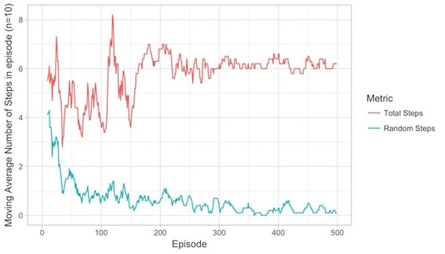
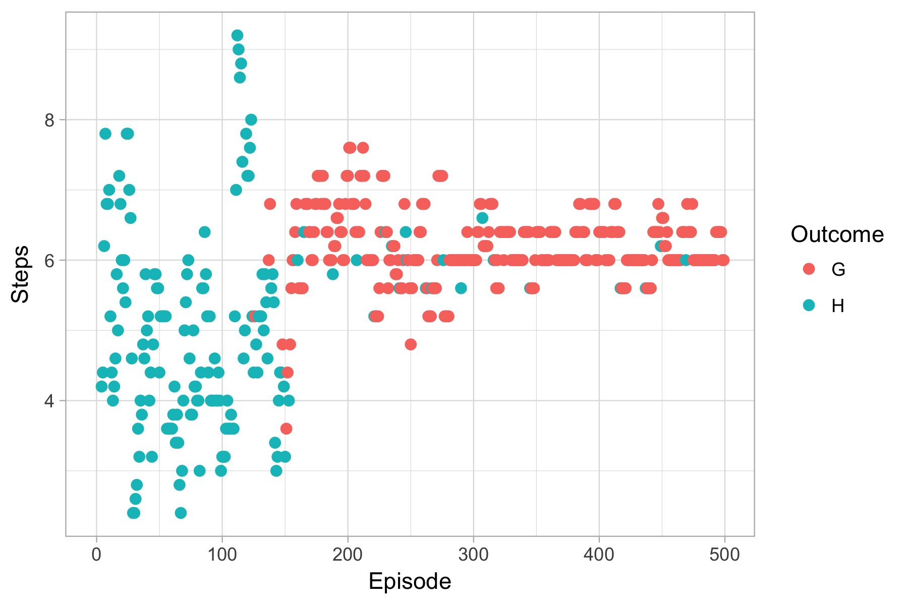
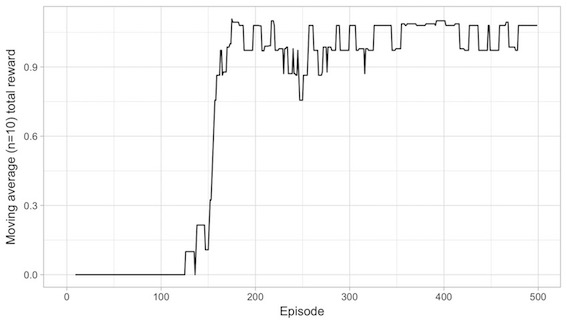

# Frozen Lake
The code in this repository aims to solve the Frozen Lake problem, one of the problems in AI gym, using Q-learning and SARSA

## Algorithms
The `FrozenQLearner.py` file contains a base `FrozenLearner` class and two subclasses `FrozenQLearner` and `FrozenSarsaLearner`. These are called by the `experiments.py` file.

## Experiments
The `experiments.py` file contains the details of the experiments run using the two algorithms. If the `output_file` parameter of the methods is set to true a CSV file summarising each session will be written to the `outputs` directory. The experiments call the `FrozenLearner` subclasses.

## Analysis
The `analysis.R` file was used to analyse the output of experiments using charts and some quantitative analysis. The charts are saved to the `plots` directory in some cases

## Requirements to Run
A python 3.x environment with gym, numpy, sklearn (tested on python 3.5) to run the experiments. An R environment with ggplot2, dplyr, TTR, reshape2, stringr to run the analysis.

Note. you will need to create two subdirectories wherever this code is stored on your filesystem; `outputs` and `plots` if you run the `experiments.py` and `analysis.R` files respectively.

## Example outputs
The total number of steps and number of random steps

Whether each episode resulted in reaching the goal 'G' or a hole 'H'

The total reward for each episode

